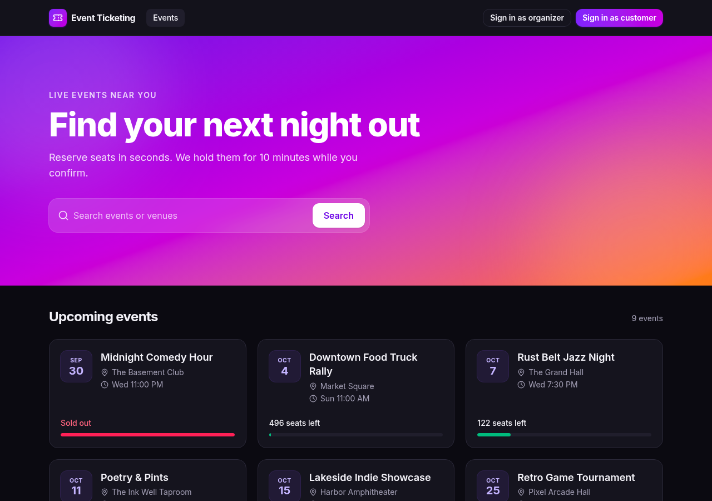
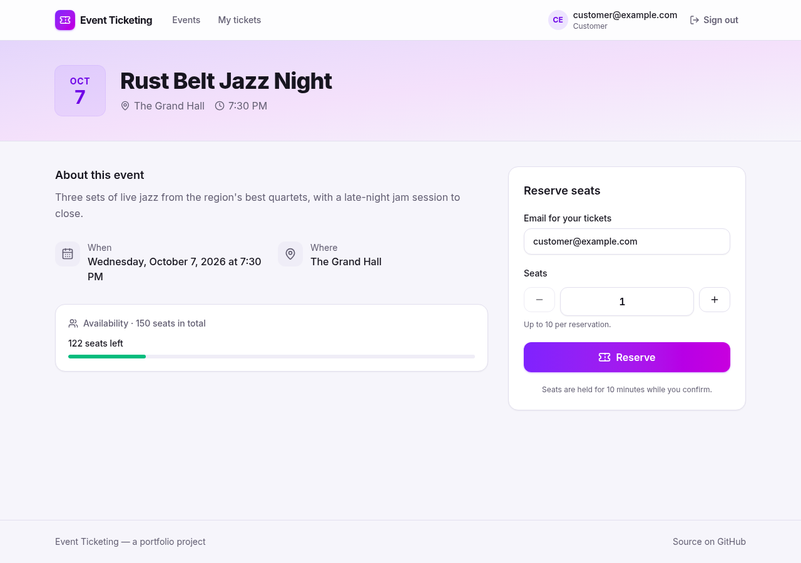
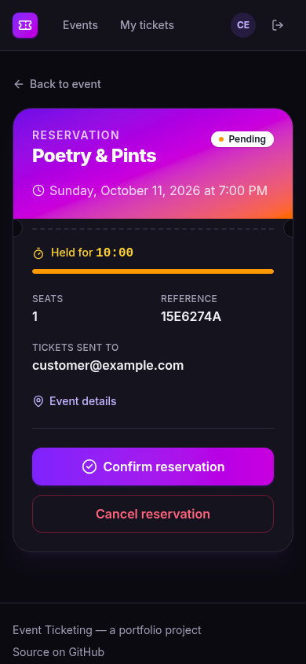
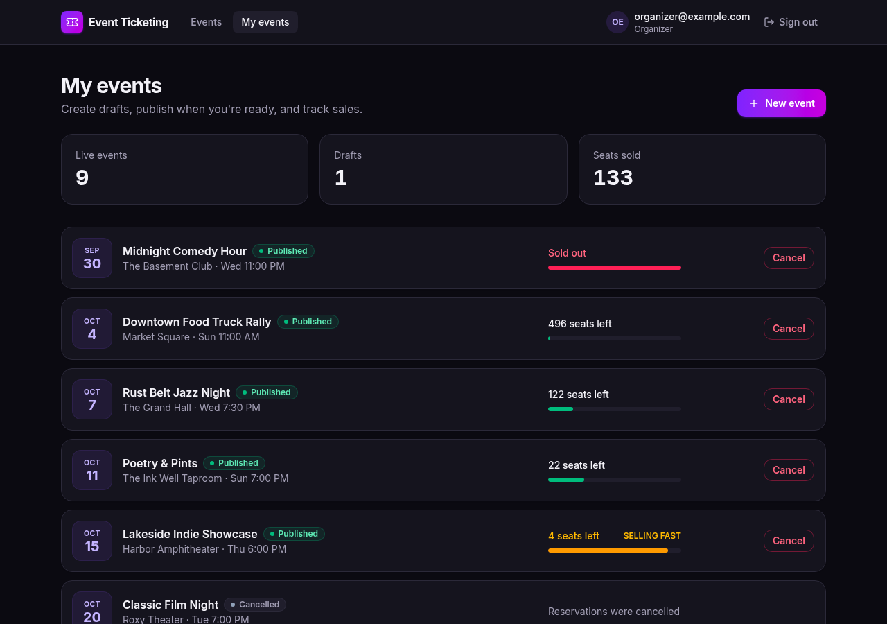

# Event Ticketing Web

[](https://github.com/ryanlakner/event-ticketing-web/actions/workflows/ci.yml)

The React front end for [event-ticketing-api](https://github.com/ryanlakner/event-ticketing-api). Customers browse events, reserve seats, and confirm before their hold runs out; organizers create, publish, and cancel their events.



| Event page (light theme)                                               | Reservation hold on a phone                                                                | Organizer dashboard                                           |
| ---------------------------------------------------------------------- | ------------------------------------------------------------------------------------------ | ------------------------------------------------------------- |
|  |  |  |

| Concern          | Choice                                                                                       |
| ---------------- | -------------------------------------------------------------------------------------------- |
| App              | React 19, TypeScript 6 (strict), Vite 8                                                      |
| Styling          | Tailwind CSS v4 with light and dark themes, Lucide icons, Inter                              |
| Routing and data | React Router 8, TanStack Query                                                               |
| API client       | `openapi-fetch`, typed by `openapi-typescript` from the API's committed OpenAPI contract     |
| Sign-in          | Microsoft Entra ID with MSAL (authorization code + PKCE), or local `dotnet user-jwts` tokens |
| Linting          | ESLint 9 with the Airbnb rules (`eslint-config-airbnb-extended`) and strict TypeScript rules |
| Formatting       | Prettier, configured to Airbnb's style, with Tailwind class sorting                          |
| Tests            | Vitest, React Testing Library, Mock Service Worker                                           |
| Git hooks        | Husky, lint-staged, commitlint (Conventional Commits)                                        |

## Features

- **Browse** published events, with search and live seat availability. No sign-in needed.
- **Reserve** seats as a customer. The reservation page counts down the 10-minute hold and offers confirm and cancel.
- **My tickets** lists a customer's reservations, soonest event first.
- **My events** lets an organizer create drafts, publish them, and cancel events.
- Navigation and pages adapt to the signed-in user's roles. That's for convenience only: the API enforces every rule itself.
- API errors appear as their problem-details message, and validation errors show next to the field they belong to.
- Light and dark themes follow the operating system. Layouts adapt from phones to desktops, with loading skeletons and empty states throughout.

## Getting started

**Prerequisites:** Node.js 22 or later (CI uses the LTS version in `.nvmrc`), and [event-ticketing-api](https://github.com/ryanlakner/event-ticketing-api) running locally.

```bash
npm install          # also installs the git hooks
cp .env.example .env.local
npm run dev          # http://localhost:5173
```

`npm run dev` proxies `/api` to the API at `http://localhost:5084`, so the browser stays on one origin and no CORS setup is needed. Point it elsewhere with `API_PROXY_TARGET`.

### Signing in locally, without an Entra ID tenant

In your event-ticketing-api checkout, create development tokens:

```bash
dotnet user-jwts create --project Ticketing.Api --name organizer@example.com --role Organizer --output token
dotnet user-jwts create --project Ticketing.Api --name customer@example.com --role Customer --output token
```

Paste them into `VITE_DEV_ORGANIZER_TOKEN` and `VITE_DEV_CUSTOMER_TOKEN` in `.env.local`. The header then offers **Sign in as organizer** and **Sign in as customer**.

### Signing in with Entra ID

The API's bootstrap creates a web sign-in app registration for each environment, and its `configure-github.sh` prints the values to use. Set `VITE_ENTRA_TENANT_ID`, `VITE_ENTRA_CLIENT_ID`, and `VITE_API_SCOPE`. `http://localhost:5173` is already a registered redirect URI in `dev`.

The Entra ID configuration takes precedence over dev tokens. With neither set, the app runs browse-only. MSAL is only downloaded when Entra ID is configured.

## Scripts

| Command                           | Does                                                             |
| --------------------------------- | ---------------------------------------------------------------- |
| `npm run dev`                     | Dev server with hot reload and the API proxy                     |
| `npm run build`                   | Type-check and build for production into `dist/`                 |
| `npm run lint`                    | ESLint with the Airbnb rules; any warning fails                  |
| `npm run format` / `format:check` | Prettier                                                         |
| `npm run typecheck`               | `tsc -b`                                                         |
| `npm test` / `test:watch`         | Vitest                                                           |
| `npm run verify`                  | Everything CI runs: format check, lint, type-check, tests, build |
| `npm run api:sync`                | Download the latest API contract and regenerate the types        |

## Code standards

**ESLint uses the Airbnb style guide** through [`eslint-config-airbnb-extended`](https://eslint-airbnb-extended.nishargshah.dev/). That's the maintained port of Airbnb's rules to ESLint's flat config, with TypeScript support: the original `eslint-config-airbnb` only supports ESLint 8 and hasn't been published since 2021, and `eslint-config-airbnb-typescript` has been archived. The configuration in [`eslint.config.js`](eslint.config.js) layers:

- Airbnb's base, React, React Hooks, and JSX accessibility rules
- Airbnb's TypeScript rules, plus its strict TypeScript add-on (no `any`, no non-null assertions)
- Airbnb's Node.js rules, only for files that run in Node (`scripts/`, config files)
- `eslint-config-prettier`, which turns off style rules so Prettier alone formats the code (like CSharpier in the API)

Deliberate deviations, each commented in the config:

- `react/react-in-jsx-scope` and `react/jsx-uses-react` are off. They predate React 17's automatic JSX runtime.
- `react/require-default-props` still requires a default for every optional prop, but as a default parameter instead of `defaultProps`, which React 19 removed for function components.
- `@typescript-eslint/explicit-module-boundary-types`, from the strict add-on rather than Airbnb itself, is off. `tsc` already infers and checks return types.
- Tests and test helpers may import `devDependencies`.

**Version pins to know about:** ESLint stays on 9 because `eslint-config-airbnb-extended` doesn't support ESLint 10 yet. TypeScript stays on 6.0 because `typescript-eslint` doesn't support TypeScript 7 yet. `openapi-typescript` declares a TypeScript 5 peer range, so a narrow `overrides` entry in `package.json` lets it use TypeScript 6, whose compiler API it relies on unchanged.

## API contract

[`openapi/ticketing-api.v1.json`](openapi/ticketing-api.v1.json) is a copy of the API's committed OpenAPI document, and [`src/api/schema.d.ts`](src/api/schema.d.ts) is generated from it. Every request and response is typed, so a breaking API change fails the build here instead of at runtime. CI checks that the generated types match the contract.

After the API changes, run `npm run api:sync` to refresh both. To preview an unreleased API change, set `API_CONTRACT_URL` to another branch's raw file, or `API_CONTRACT_PATH` to a local checkout.

## Testing

Page tests render the whole app at a URL and talk to the real API client, with [Mock Service Worker](https://mswjs.io/) answering the HTTP requests. They cover routing, role gating, the bearer token on requests, request bodies, problem-details errors, and navigation after a reservation. Any request without a mock fails the test.

## Commits and git hooks

Commits follow [Conventional Commits 1.0.0](https://www.conventionalcommits.org/en/v1.0.0/), the same rules as the API repo. Husky installs the hooks on `npm install`:

| Hook         | Runs                                              |
| ------------ | ------------------------------------------------- |
| `pre-commit` | ESLint and Prettier on staged files (lint-staged) |
| `commit-msg` | commitlint                                        |
| `pre-push`   | `npm run verify`                                  |

CI runs commitlint again over pushed commits and pull request titles.

## Project layout

```
src/
  api/          Typed client, generated schema, TanStack Query hooks
  auth/         Sign-in: MSAL (Entra ID), dev tokens, or anonymous; role helpers
  components/   Layout, event cards, availability bar, countdown, badges, errors
  components/ui Shared primitives: container, page header, empty state
  lib/          Formatting helpers and shared Tailwind class recipes
  pages/        One component per route
  test/         Test setup, MSW server, fixtures, render helper
openapi/        Vendored API contract
docs/           README screenshots
scripts/        Contract sync
```

## Roadmap

See [ROADMAP.md](ROADMAP.md).
